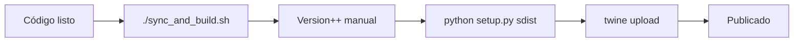
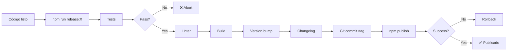

# 🔄 Comparación: Django (PyPI) vs Node.js (npm)

## 📊 Tabla Comparativa

| Aspecto                    | Django/PyPI           | Node.js/npm           | Recomendación             |
| -------------------------- | --------------------- | --------------------- | ------------------------- |
| **Package Manager**        | PyPI (pip)            | npm/yarn/pnpm         | npm (estándar)            |
| **Versioning**             | setup.py/setup.cfg    | package.json          | package.json ✅           |
| **Build**                  | python setup.py sdist | npm run build         | TypeScript compiler       |
| **Publish**                | twine upload          | npm publish           | npm publish ✅            |
| **Auth**                   | .pypirc               | npm login / token     | npm token (CI/CD)         |
| **Pre-release**            | N/A en setup.py       | npm tags (beta/alpha) | npm dist-tags ✅          |
| **Semantic Versioning**    | Manual                | npm version           | Automatizado ✅           |
| **Changelog**              | Manual                | Manual + automated    | Usar conventional commits |
| **Testing before publish** | Manual                | prepublishOnly script | Hook automatizado ✅      |
| **Type definitions**       | N/A                   | .d.ts incluidos       | TypeScript nativo ✅      |

## 🆚 Tu Script Django vs Scripts Node.js

### Script Django Original (`sync_and_build.sh`)

```bash
# ❌ Manual version parsing con grep/sed
version=$(grep -oP '(?<=version = ).*' setup.cfg)
version=$(echo $version | awk -F. '{$NF = $NF + 1;} 1' | sed 's/ /./g')
sed -i "s/version = .*/version = $version/" setup.cfg

# ❌ Build y upload separado
python3 setup.py sdist
twine upload --config=.pypirc dist/django_nets_core-$version.tar.gz
```

**Problemas:**

- ⚠️ Solo incrementa patch (último número)
- ⚠️ No ejecuta tests antes de publicar
- ⚠️ No crea tags de git automáticamente
- ⚠️ No actualiza CHANGELOG
- ⚠️ Requiere manipulación manual de strings

### Scripts Node.js Nuevos ✅

```bash
# ✅ Semantic versioning automático
npm version patch|minor|major

# ✅ Tests automáticos pre-publish
prepublishOnly script

# ✅ Tags de git automáticos
npm version crea commit + tag

# ✅ Publish simplificado
npm publish --access public
```

**Ventajas:**

- ✅ Semantic versioning completo (patch/minor/major)
- ✅ Tests y linting automáticos
- ✅ Git tags automáticos
- ✅ Rollback si falla publicación
- ✅ Interactivo con confirmaciones
- ✅ Soporte pre-releases (beta/alpha)

## 🎯 Mejores Prácticas Adoptadas

### 1. **Conventional Commits**

```bash
# Django (antes)
git commit -m "fix"

# Node.js (ahora)
git commit -m "fix: correct authentication bug in JWT validation"
git commit -m "feat: add support for custom email templates"
git commit -m "feat!: change API signature for UserDevice"
```

### 2. **Pre-publish Hooks**

```json
{
  "scripts": {
    "prepublishOnly": "npm run test && npm run lint && npm run build"
  }
}
```

❌ Django: Sin validación automática
✅ Node.js: Imposible publicar si fallan tests

### 3. **Semantic Versioning Automático**

```bash
# Django: Solo patch manual
./sync_and_build.sh  # 1.0.0 -> 1.0.1

# Node.js: Semántico completo
npm run release:patch  # 1.0.0 -> 1.0.1 (bug fixes)
npm run release:minor  # 1.0.0 -> 1.1.0 (features)
npm run release:major  # 1.0.0 -> 2.0.0 (breaking)
```

### 4. **Pre-releases**

```bash
# Django: No soportado nativamente
# Requeriría cambiar nombre del paquete o sufijo manual

# Node.js: Tags de distribución
npm run release:beta    # 1.0.0 -> 1.0.1-beta.0
npm install pkg@beta    # Usuarios instalan beta
npm install pkg@latest  # Usuarios instalan stable
```

### 5. **Verificación Pre-release**

```bash
# Django: Manual
python3 setup.py check

# Node.js: Automatizado
npm run version:check   # Ver versiones
npm audit              # Vulnerabilidades
npm outdated           # Dependencias desactualizadas
```

## 📋 Workflow Comparison

### Workflow Django (Original)



**Pasos:** 2 (ejecutar script, esperar)
**Validación:** ❌ Ninguna automática
**Rollback:** ❌ Difícil

### Workflow Node.js (Nuevo)



**Pasos:** 1 comando (automatizado)
**Validación:** ✅ Tests + Linter + Build
**Rollback:** ✅ Automático si falla

## 🚀 Casos de Uso

### Caso 1: Bug Fix Release

```bash
# Django (antes)
# 1. Editar setup.cfg manualmente
# 2. ./sync_and_build.sh
# 3. Esperar 30 segundos
# 4. Verificar en PyPI manualmente

# Node.js (ahora)
npm run release:patch
# Todo automático en 1 comando
```

### Caso 2: Nueva Feature

```bash
# Django (antes)
# 1. Editar setup.cfg manualmente (cambiar segundo número)
# 2. ./sync_and_build.sh
# 3. Puede publicar versión incorrecta

# Node.js (ahora)
npm run release:minor
# Incrementa correctamente: 1.0.0 -> 1.1.0
```

### Caso 3: Breaking Change

```bash
# Django (antes)
# 1. Editar setup.cfg manualmente (cambiar primer número)
# 2. ./sync_and_build.sh
# 3. Sin distinción clara para usuarios

# Node.js (ahora)
npm run release:major
# 1.0.0 -> 2.0.0
# Usuarios ven claramente que es breaking
```

### Caso 4: Beta Release

```bash
# Django (antes)
# No soportado
# Alternativa: crear paquete separado django-nets-core-beta

# Node.js (ahora)
npm run release:beta
# 1.0.0 -> 1.0.1-beta.0
# npm install nodejs-nets-core@beta
```

## 🔐 Seguridad y Autenticación

### Django/PyPI

```ini
# .pypirc (credenciales en texto plano)
[pypi]
username = __token__
password = pypi-xxxxxxxxxxxxx
```

### Node.js/npm

```bash
# Token como variable de entorno
export NPM_TOKEN=xxxxxxxxxxxxx

# O npm login (interactivo, más seguro)
npm login

# Para CI/CD
# GitHub Actions, GitLab CI, etc.
NPM_TOKEN en secrets
```

## 📈 Ventajas del Nuevo Sistema

| Ventaja                 | Descripción                       | Impacto     |
| ----------------------- | --------------------------------- | ----------- |
| **Menos errores**       | Validación automática pre-publish | 🔴→🟢 Alto  |
| **Más rápido**          | 1 comando vs proceso manual       | 🟡→🟢 Medio |
| **Semantic versioning** | Versionado correcto automático    | 🔴→🟢 Alto  |
| **Git integration**     | Tags automáticos, commits         | 🟡→🟢 Medio |
| **Rollback**            | Reversión si falla                | 🔴→🟢 Alto  |
| **Pre-releases**        | Beta/alpha support nativo         | ❌→🟢 Alto  |
| **Type safety**         | .d.ts incluidos automáticamente   | ❌→🟢 Alto  |
| **CI/CD friendly**      | Scripts para automatización       | 🟡→🟢 Alto  |

## 🎓 Comandos Equivalentes

| Tarea               | Django                   | Node.js                     |
| ------------------- | ------------------------ | --------------------------- |
| Ver versión actual  | `grep version setup.cfg` | `npm run version:check`     |
| Incrementar patch   | `./sync_and_build.sh`    | `npm run release:patch`     |
| Incrementar minor   | Manual en setup.cfg      | `npm run release:minor`     |
| Incrementar major   | Manual en setup.cfg      | `npm run release:major`     |
| Publicar            | `twine upload`           | `npm publish`               |
| Ver en registry     | Ver PyPI web             | `npm view nodejs-nets-core` |
| Instalar específica | `pip install pkg==1.0.0` | `npm install pkg@1.0.0`     |
| Descargar stats     | PyPI stats web           | `npm-stat.com`              |

## ✅ Checklist de Migración

- [x] Scripts de release creados
- [x] package.json configurado
- [x] .npmignore configurado
- [x] Documentación de publicación
- [x] Scripts con validación
- [x] Soporte pre-releases
- [x] Git hooks configurados
- [x] CI/CD friendly

## 🔄 Próximos Pasos

1. **Configurar npm account**

   ```bash
   npm login
   npm whoami
   ```

2. **Primera publicación**

   ```bash
   npm run release:patch
   ```

3. **Configurar CI/CD** (opcional)
   - GitHub Actions para auto-publish en tags
   - Semantic release automation
   - Automated changelog generation

4. **Monitoring**
   - npm downloads tracking
   - Bundle size monitoring
   - Deprecation warnings

## 📚 Referencias

- [npm semantic versioning](https://docs.npmjs.com/about-semantic-versioning)
- [npm publishing guide](https://docs.npmjs.com/packages-and-modules/contributing-packages-to-the-registry)
- [npm dist-tags](https://docs.npmjs.com/cli/v8/commands/npm-dist-tag)
- [Conventional Commits](https://www.conventionalcommits.org/)
